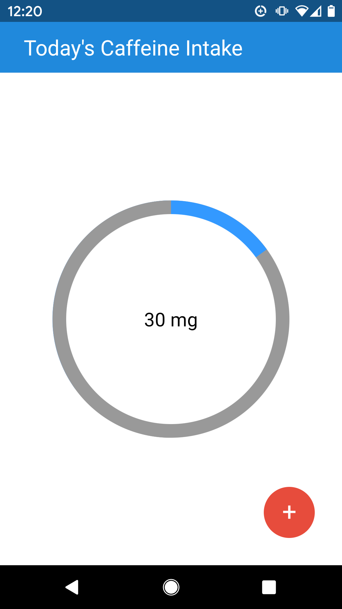
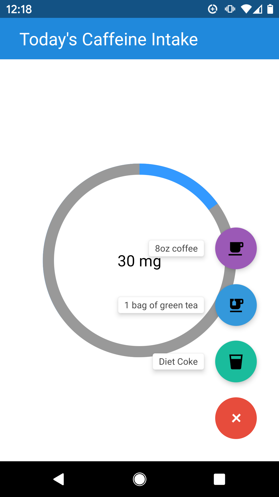

# caffeine-counter
Simple caffeine tracker (coffee, tea, diet coke)

Why, yes, it does assume you're aiming for 200mg of caffeine, because that's the recommended amount for pregnant ladies and I'm asserting my personal constraints onto this code :joy: 
